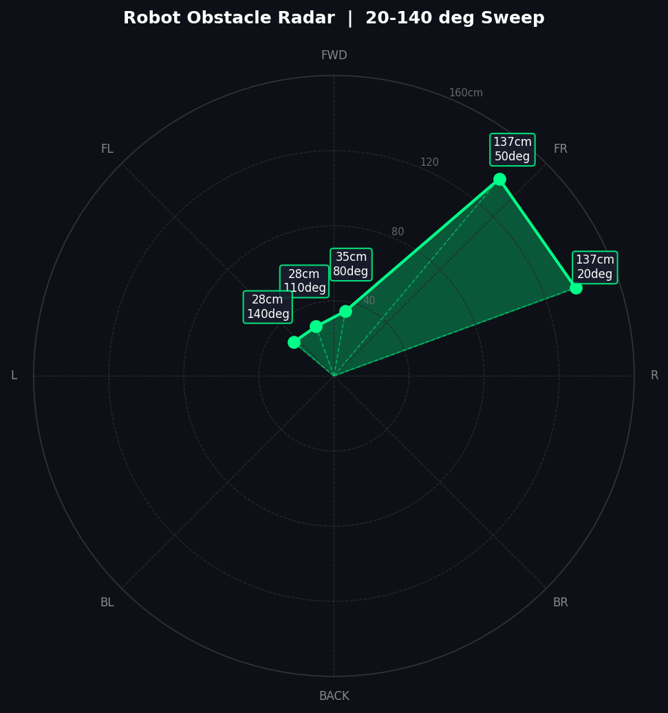
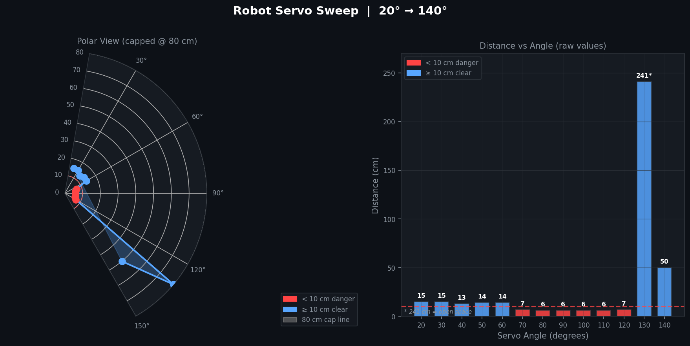
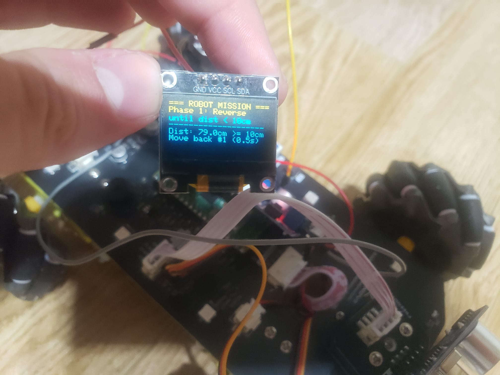
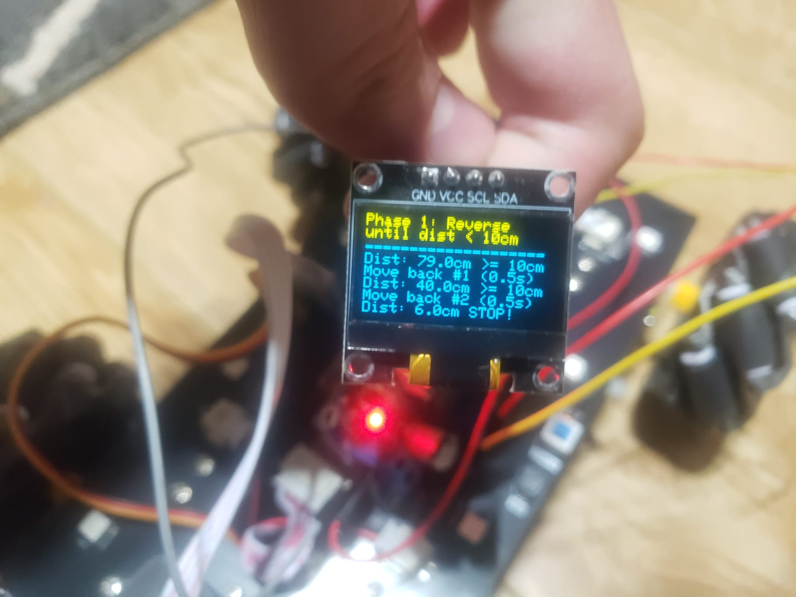
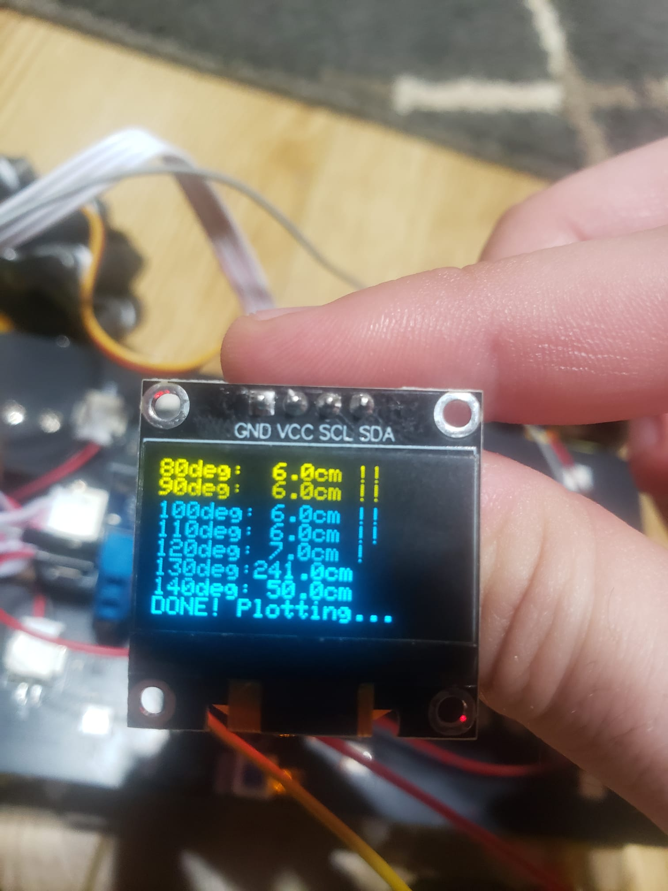
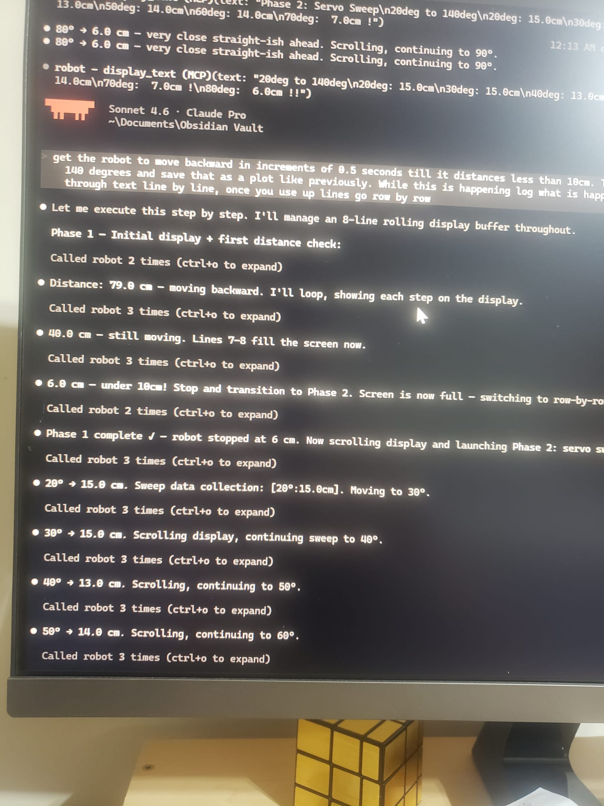
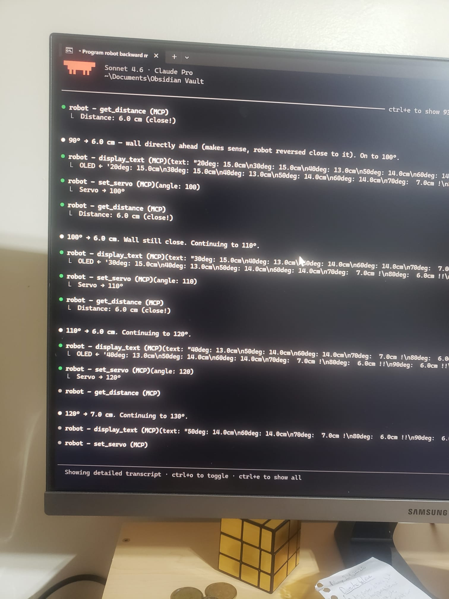
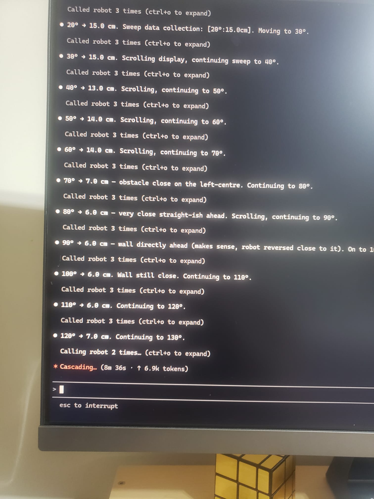
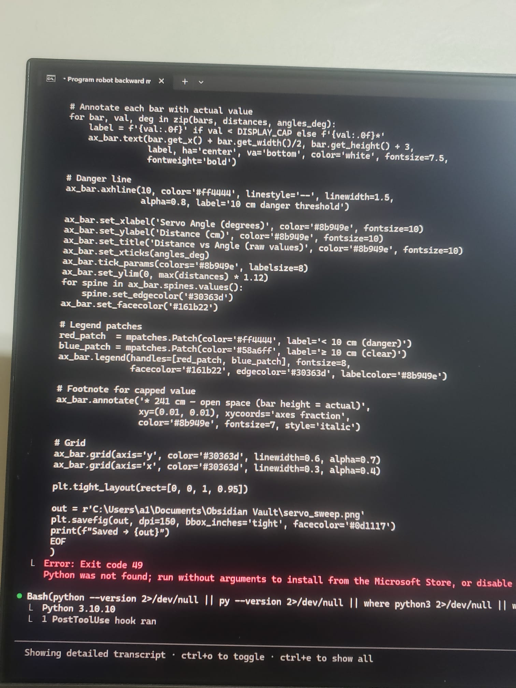

# AgenticRobot 🤖

Control a **Freenove 4WD Mecanum Wheel Robot Car** with natural-language commands — powered by Claude via the [Model Context Protocol (MCP)](https://modelcontextprotocol.io).

Talk to Claude Code and it drives the robot. No app, no joystick — just describe what you want:

```
"Drive in a square pattern"
"Scan for obstacles and find the clearest direction"
"Do a celebration spin, flash the LED green, and beep twice"
"Keep moving forward and stop if anything is closer than 25 cm"
```

---

## How It Works

```
You (Claude Code)  →  MCP tool call  →  robot_mcp server  →  TCP command  →  Pico W  →  Robot
```

1. Claude Code connects to the `robot_mcp` server (started automatically via `.mcp.json`).
2. You describe a task in plain English; Claude calls tools like `move_forward`, `scan_distances`, `set_led`, `display_text`.
3. Each tool call sends a plain-text TCP command to the Pico W on **port 4002**.
4. Tool results flow back to Claude, which adapts and continues until the task is complete.

There's also a **standalone agent** (`agent/`) that uses the Anthropic API directly — no Claude Code needed.

---

## What Can It Do?

### Obstacle radar — servo sweep + distance map

Claude sweeps the ultrasonic sensor head and builds a live obstacle map:



*Above: `scan_distances` result visualised — the servo sweeps from 20° to 140° while Claude reads HC-SR04 distances. Claude uses this to plan its next move.*

### Reverse-until-close + full sweep with live OLED logging

One of the more complex sample sessions: Claude reverses the robot in 0.5 s bursts until it's within 10 cm of a wall, then sweeps the full 20°–140° arc and saves the result as a plot — all while narrating every step on the OLED display in real time:



*Above: output of the reverse-and-sweep session. 90° is straight ahead; the dense red cluster (70°–120°, 6–7 cm) is the wall the robot reversed into. 130° opens to 241 cm — clear space to the left.*

### OLED live status display *(new)*

Claude writes rolling status text to the robot's 0.96″ SSD1306 OLED as it works — line by line, then scrolling row by row once the 8-line screen is full:

| Phase 1 — mission start | Phase 1 — reverse complete | Phase 2 — sweep done |
|:-:|:-:|:-:|
|  |  |  |

*The display updates after every tool call — distance readings, move counts, angle results, and final status.*

---

## Sample Session

> **Prompt given to Claude Code:**
> *"Get the robot to move backward in increments of 0.5 seconds till it distances less than 10 cm. Then range the servo from 20 to 140 degrees and save that as a plot like previously. While this is happening log what is happening on the display through text line by line, once you use up lines go row by row."*

Claude planned and executed the following sequence autonomously:

### Phase 1 — Reverse to wall

| Step | MCP tool called | Result |
|------|----------------|--------|
| 1 | `display_text("=== ROBOT MISSION ===\nPhase 1: Reverse\nuntil dist < 10cm\n…")` | Header on OLED |
| 2 | `get_distance()` | 79.0 cm — too far, keep going |
| 3 | `display_text(…)` + `move_backward(speed=40, duration=0.5)` | Move #1 |
| 4 | `get_distance()` | 40.0 cm — still too far |
| 5 | `display_text(…)` + `move_backward(speed=40, duration=0.5)` | Move #2 |
| 6 | `get_distance()` | **6.0 cm — under 10 cm → STOP** |
| 7 | `stop()` + `display_text("Dist: 6.0cm STOP!")` | Phase 1 done |

*Display scrolled row-by-row once all 8 lines were filled.*

### Phase 2 — Servo sweep 20°→140°

Claude called `set_servo(angle)` + `get_distance()` + `display_text(…)` for each of the 13 angles in sequence, updating the rolling OLED buffer after every reading:

```
20°:  15.0 cm   30°:  15.0 cm   40°:  13.0 cm   50°:  14.0 cm
60°:  14.0 cm   70°:   7.0 cm   80°:   6.0 cm   90°:   6.0 cm  ← wall
100°:  6.0 cm  110°:   6.0 cm  120°:   7.0 cm  130°: 241.0 cm  ← open!
140°: 50.0 cm
```

Then generated and saved the dual-panel plot via a Python `Bash` tool call.

### Terminal output

| Session overview — prompt through Phase 2 | Sweep MCP calls mid-session |
|:-:|:-:|
|  |  |

| All sweep angle outputs | Plot generation |
|:-:|:-:|
|  |  |

The same behaviour is reproducible as a **standalone Python script** (no Claude needed):

```bash
python examples/reverse_and_sweep.py --ip 192.168.x.x
```

See [`examples/reverse_and_sweep.py`](examples/reverse_and_sweep.py) for the full implementation.

---

## Hardware

- **[Freenove 4WD Car Kit for Raspberry Pi Pico W](https://github.com/Freenove/Freenove_4WD_Car_Kit_for_Raspberry_Pi_Pico)**
  - Raspberry Pi Pico W (on-board WiFi)
  - 4× mecanum wheels (strafe in any direction without rotating)
  - HC-SR04 ultrasonic sensor on a servo head (aimed left/centre/right)
  - WS2812 RGB LED + buzzer
  - **0.96″ SSD1306 OLED display** (128×64 px, I²C) ← added for live status logging

---

## Quick Start

### 1. Flash the firmware

The patched sketch is included in this repo at:
```
firmware/06.2_Multi_Functional_Car/06.2_Multi_Functional_Car.ino
```

Open it in **Arduino IDE**, fill in your WiFi credentials near the top:
```cpp
const char* ssid     = "YOUR_WIFI_SSID";
const char* password = "YOUR_WIFI_PASSWORD";
```

Select **Raspberry Pi Pico W** as the board and upload.

> ⚠️ The Pico W only connects to **2.4 GHz** networks.

This sketch is based on [`06.2_Multi_Functional_Car`](https://github.com/Freenove/Freenove_4WD_Car_Kit_for_Raspberry_Pi_Pico) from the Freenove repo, with two additions:
- A `U\n` TCP command that returns the HC-SR04 distance reading on demand — see [`firmware/ultrasonic_patch.md`](firmware/ultrasonic_patch.md).
- An `O\n` TCP command that writes text to the SSD1306 OLED display — see [`firmware/oled_patch.md`](firmware/oled_patch.md).

### 2. Find the robot's IP

Power on the robot. Check your router's DHCP table, or read it from the Arduino IDE Serial Monitor at 115200 baud:
```
Connected! IP address: 192.168.1.42
TCP Server started on port 4002
```

### 3. Install Python dependencies

```bash
pip install -r requirements.txt
```

### 4. Configure `.env`

```bash
cp .env.example .env
# Edit .env — set ROBOT_IP and (if using standalone agent) ANTHROPIC_API_KEY
```

### 5. Test the hardware

```bash
python examples/drive_test.py
```

Tests: battery → LED (R/G/B) → buzzer → servo sweep → motors. No API key needed.

### 6a. Use via Claude Code (MCP — recommended)

Add the MCP server to your Claude Code config (`~/.claude/settings.json`):

```json
{
  "mcpServers": {
    "robot": {
      "command": "python",
      "args": ["-m", "robot_mcp"],
      "cwd": "/path/to/AgenticRobot"
    }
  }
}
```

Then just talk to Claude Code naturally — it will call the robot tools automatically.

### 6b. Use the standalone agent

```bash
python -m agent.agent --task "Drive in a square pattern"
python -m agent.agent          # interactive REPL
```

Requires `ANTHROPIC_API_KEY` in `.env`.

### 6c. Run the reverse-and-sweep example directly

```bash
python examples/reverse_and_sweep.py --ip 192.168.x.x
# or with a custom plot output path:
python examples/reverse_and_sweep.py --ip 192.168.x.x --out my_sweep.png
```

---

## Available Tools

| Tool | Description |
|------|-------------|
| `move_forward` / `move_backward` | Drive straight (speed 0–100, duration in seconds) |
| `strafe_left` / `strafe_right` | Slide sideways without yawing (mecanum only) |
| `rotate_left` / `rotate_right` | Spin in place |
| `move_diagonal` | Diagonal movement (forward_left, forward_right, …) |
| `stop` | Emergency stop |
| `get_distance` | HC-SR04 distance reading in cm (requires firmware patch) |
| `scan_distances` | Sweep servo and read distance at 45°, 90°, 135° |
| `get_battery` | Query voltage (warns if < 6.5 V) |
| `set_led` | WS2812 RGB colour |
| `beep` | Buzzer at given Hz |
| `set_servo` | Aim the head servo (0–180°, 90 = straight ahead) |
| `display_text` | Write rolling text to the SSD1306 OLED (requires oled_patch) |
| `wait` | Pause for N seconds |

---

## Project Layout

```
robot/              ← TCP SDK (no AI dependency)
  commands.py       ← protocol constants
  client.py         ← raw socket I/O
  controller.py     ← high-level API (includes display_text)

robot_mcp/          ← MCP server (Claude Code integration)
  server.py         ← FastMCP tool definitions
  __main__.py       ← entry point: python -m robot_mcp

agent/              ← Standalone Claude agent (no MCP needed)
  tools.py          ← tool definitions for the Anthropic API
  agent.py          ← agent loop + tool executor

firmware/
  ultrasonic_patch.md  ← 4-line patch to add TCP distance query
  oled_patch.md        ← patch to add TCP OLED display command (NEW)

examples/
  drive_test.py          ← hardware connectivity test (no API key)
  reverse_and_sweep.py   ← reverse-until-close + servo sweep + plot (NEW)

docs/
  robot_radar.png        ← scan_distances visualisation

Media/
  servo_sweep.png              ← reverse-and-sweep session output plot
  oled-mission-start-on-robot.jpeg
  oled-phase1-reverse-complete.jpeg
  oled-sweep-done-closeup.jpeg
  terminal-full-session-start.jpeg
  terminal-mcp-calls-sweep-mid.jpeg
  terminal-sweep-angles-output.jpeg
  terminal-plot-code-generation.jpeg
  … (+ video clips of live sessions)
```

---

## Firmware & Attribution

The robot firmware is from **[Freenove's open-source kit](https://github.com/Freenove/Freenove_4WD_Car_Kit_for_Raspberry_Pi_Pico)** — specifically sketch `06.2_Multi_Functional_Car`, which runs a TCP server on the Pico W and handles motor, servo, LED, and buzzer commands.

This project adds:
- A Python TCP SDK (`robot/`) that wraps the Freenove protocol
- An MCP server (`robot_mcp/`) exposing all robot functions as Claude tools
- A standalone agentic loop (`agent/`) using the Anthropic API directly
- A [4-line firmware patch](firmware/ultrasonic_patch.md) to expose the ultrasonic sensor over TCP
- An [OLED firmware patch](firmware/oled_patch.md) to write live status text to the SSD1306 display over TCP

The Freenove firmware repo is **not bundled here** — clone it separately from the link above and flash `06.2_Multi_Functional_Car.ino`.

---

## Detailed Setup Guide

See [`INSTRUCTIONS.md`](INSTRUCTIONS.md) for a step-by-step walkthrough: Arduino IDE setup, board support installation, firmware flashing, IP discovery, MCP configuration, and troubleshooting.
